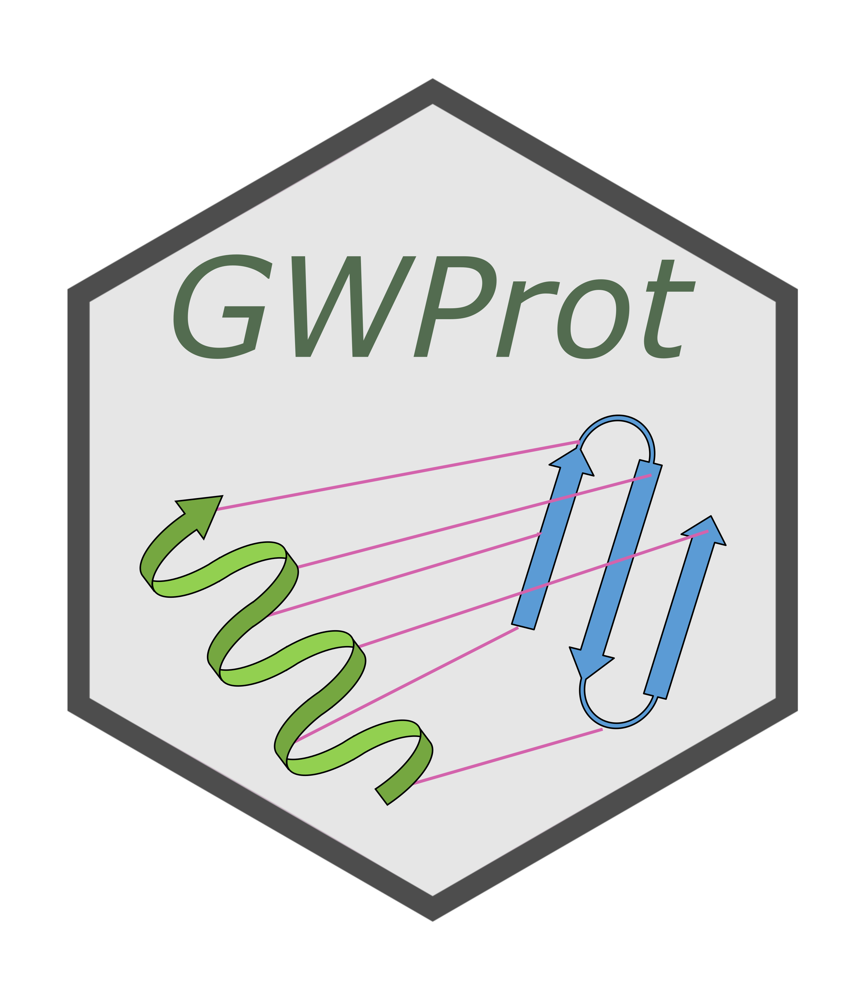

# GWProt <a href='https://github.com/CamaraLab/GWProt'></a>


GWProt is a Python library for structural alignment of proteins using the Gromov-Wasserstein distance.

Installation
=======================================

``pip install git+https://github.com/CamaraLab/GWProt``

GWProt uses [Pymol 3](https://pymol.org/) for visualization and the [fasta36](https://fasta.bioch.virginia.edu/fasta_www2/fasta_down.shtml) package for sequence alignment. These must be installed and added to the ``PATH`` environment variable if you wish to use visualization and sequence-alignment features. However, all other GWProt functionality is unaffected if they are not installed.

Documentation
=======================================

Full documentation and tutorials can be found at [gwprot.readthedocs.io](https://gwprot.readthedocs.io/).

Docker
=================================

We provide a Docker image which contains GWProt and its dependencies, ```gwprot:latest``` is built on top of the Docker image ```jupyter/base-notebook```. Running the following command will launch a Jupyter notebook server on localhost with GWProt and its dependencies installed:
```commandline
docker run -it -p 8888:8888 -v C:\Users\myusername\Documents\myfolder:/home/jovyan/work camaralab/gwprot
```
The ```-p``` flag controls the port number on local host. For example, writing ```-p 4264:8888``` will let you access the Jupyter server from 127.0.0.1:4264. The ```-v``` "bind mount" flag allows one to mount a local directory on the host machine to a folder inside the container so that you can read and write files on the host machine from within the Docker image. Here one must mount the folder on the host machine as /home/jovyan/work or /home/jovyan/some_other_folder as the primary user "jovyan" in the Docker image only has access to that directory and to the /opt/conda folder. See the [Jupyter docker image documentation](https://jupyter-docker-stacks.readthedocs.io/en/latest/using/selecting.html) for more information.
