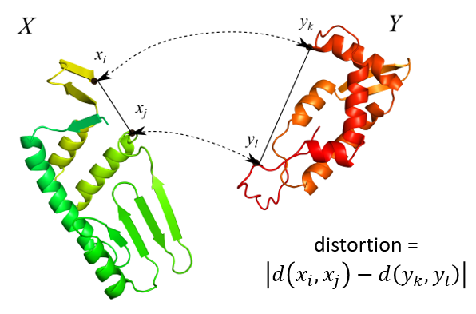

.. -*- coding: utf-8 -*-

Gromov-Wasserstein Correspondences
==================================

Overview
--------
GWProt treats proteins as point clouds in 3-dimensional space defined by their alpha-carbons. The 
Gromov-Wasserstein (GW) distance [1]_ between two point clouds quantifies how different the 
two structures are, up to rigid transformations (rotations and translations).

Intuitively, GW compares proteins by structurally aligning their residues in a way that 
minimizes distortion between their internal distance matrices.

Gromov-Hausdorff Distance
-------------------------
As a starting point, we can form a one-to-one pairing :math:`f` between the residues in 
protein :math:`X` and those in protein :math:`Y` that minimizes the largest distortion—the 
difference between a distance within :math:`X` and the corresponding distance in :math:`Y`. 
This defines the *Gromov-Hausdorff distance* between :math:`X` and :math:`Y`:

.. math::
   GH(X,Y) = \min_{f :X\cong Y} \max_{i,j \in X} | d_X(i,j) - d_Y(f(i),f(j)) |.

However, this is not computable in practice, as the number of possibilities for :math:`f` grows 
on the order of :math:`|X|!`.

Gromov-Wasserstein Distance
---------------------------
To address this, one can turn the problem into a continuous one that can be efficiently 
approximated [1]_. We assign each protein a total mass of 1, distributed evenly among its 
residues. Aligning two proteins of lengths :math:`n` and :math:`m` then 
amounts to transferring the mass of one protein to the other. This assignment is called a 
*correspondence* or *transport plan* and is represented as an :math:`n \times m` matrix, where each column sums 
to :math:`1/m` and each row sums to :math:`1/n`. The :math:`(i,j)`-th entry is the amount of 
mass transported from the :math:`i`-th residue of one protein to the :math:`j`-th residue of 
the other. Finding the best alignment is now equivalent to finding the optimal correspondence.

We define the Gromov-Wasserstein distance based on the sum of all distortions, weighted by 
the optimal correspondence:

.. math::
   GW(X,Y) = \min_T \frac{1}{2} \left( \sum_{i,j,k,l} |d_X(x_i,x_j) - d_Y(y_k,y_l)|^2  T_{i,k}T_{j,l} \right)^{1/2}.

This is a mathematical metric in that it satisfies basic axioms analogous to distances. Along 
with calculating the GW distance, we also obtain the optimal correspondence. The squaring and 
square root are not mathematically necessary, but are used for efficient computation.

.. note::
   In almost all cases, the calculated approximation is equivalent to the precise GW metric 
   for practical purposes. The key exception is that the calculated approximations do not 
   always satisfy the mathematical properties of the true metric (e.g., the triangle inequality 
   may not hold).

References
----------
.. [1] Mémoli, F. (2011). Gromov–Wasserstein distances and the metric approach to object matching. Foundations of Computational Mathematics, 11(4), 417-487.

